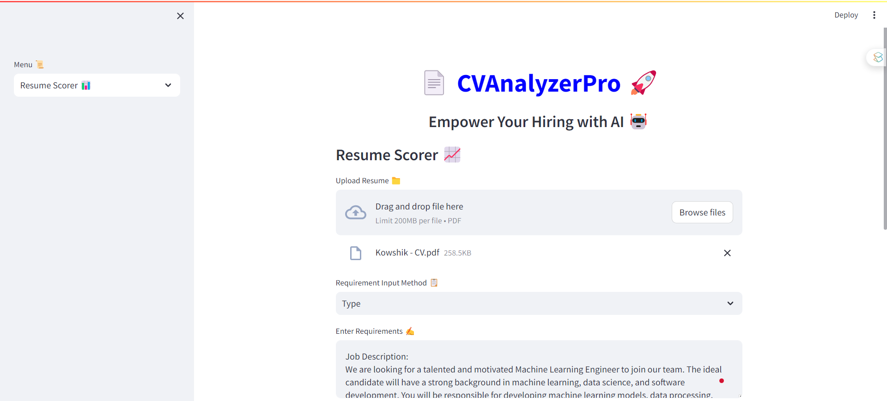
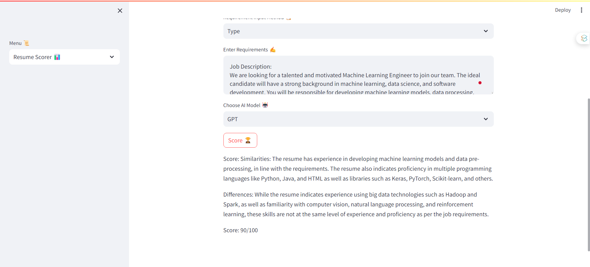
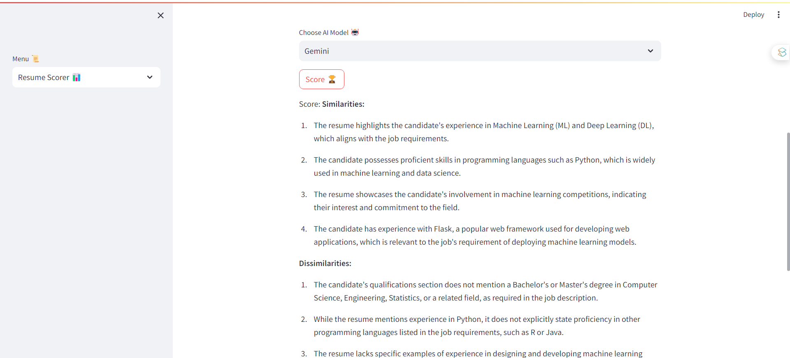
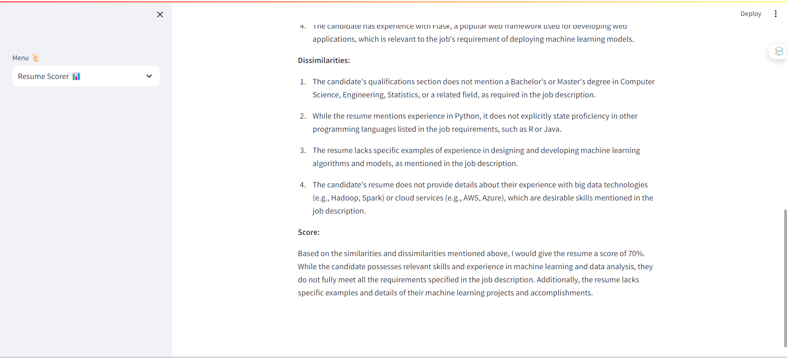
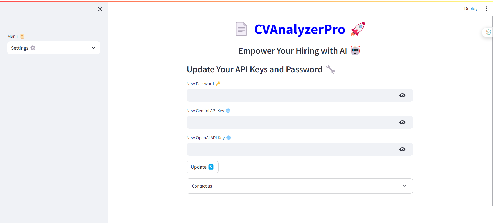
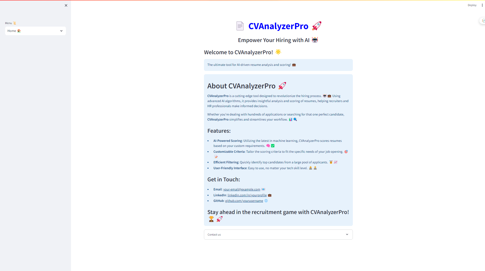
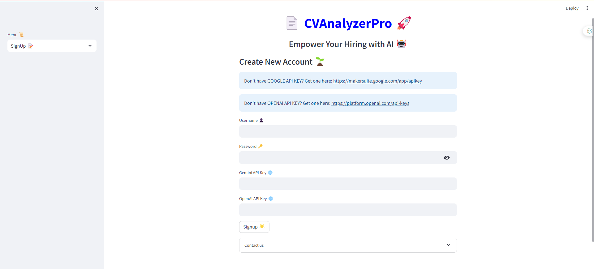

# 📄CVAnalyzerPro🔎: The ultimate tool for AI-driven resume analysis and scoring! 💼

## About CVAnalyzerPro 🚀
        
**CVAnalyzerPro** is a cutting-edge tool designed to revolutionize the hiring process. 🤖💼 Using advanced AI algorithms, it provides insightful analysis and scoring of resumes, helping recruiters and HR professionals make informed decisions. 
Whether you're dealing with hundreds of applications or searching for that one perfect candidate, **CVAnalyzerPro** simplifies and streamlines your workflow. 📊🔍

## Live Demo 🎥
👉 [https://captioncraft-b7h9xotupkyi2xs64gxmo9.streamlit.app/](https://captioncraft-b7h9xotupkyi2xs64gxmo9.streamlit.app/)

## Features:
- **AI-Powered Scoring**: Utilizing the latest in machine learning, CVAnalyzerPro scores resumes based on your custom requirements. 🧠✅
- **Customizable Criteria**: Tailor the scoring criteria to fit the specific needs of your job opening. 🎯📝
- **Efficient Filtering**: Quickly identify top candidates from a large pool of applicants. 🏅📈
- **User-Friendly Interface**: Easy to use, no matter your tech skill level. 👩‍💻👨‍💻


## Usage 💡
Provide instructions on how to use CVAnalyzerPro. This could include:
- How to upload resumes and input job requirements.
- Navigating through different features of the application.
- Interpreting the results and scores.


📹 Demo and Screenshots
👆 Click on the image above to view the demo video.
👇 Scroll down for screenshots of the application.
📸 Screenshots


|  |  |
|:--------------------------------:|:--------------------------------:|
|     **Sample Visualization 1**   |     **Sample Visualization 2**   |
|  |  |
|     **Sample Visualization 3**   |     **Sample Visualization 4**   |
|  |  |
|     **Sample Visualization 5**   |     **Sample Visualization 6**   |
|  |  |
|     **Sample Visualization 7**   |  |


## ⚙️ Installation and Setup
To set up CVAnalyzerPro, follow these steps:

Clone the repository: 
```bash
git clone https://github.com/kowshik24/CVAnalyzerPro.git
```
Install the required packages:
```bash 
pip install -r requirements.txt
```
Run the Streamlit app: 
```bash
streamlit run app.py
```
---
📞 Contact Information
For support, feedback, or contributions, please reach out to:

- 📧 **Email**: [kowshikcseruet1998@gmail.com](mailto:kowshikcseruet1998@gmail.com)
- 📱 **Phone**: 01706 896161
- 🌐 **Website**: [https://kowshik24.github.io/kowshik.github.io/](https://kowshik24.github.io/kowshik.github.io/)
- 🚀 **GitHub**: [Kowshik Deb Nath](https://github.com/kowshik24)
- 🤝 **LinkedIn**: [Kowshik Deb Nath](https://www.linkedin.com/in/kowshik-deb-nath-7a0a3a1a0/)
---